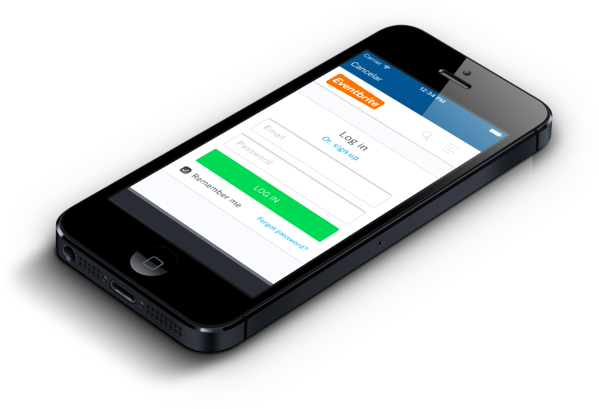

IOSEventbriteAPI
==============

A small non intrusive library that makes it easy to authenticate and authorize against Eventbrite using OAuth.
The API uses a UIWebView to authenticate against Eventbrite.



If the enduser is authenticated you end up with a code that is needed to further authenticate into Eventbrite [API](https://www.eventbrite.com/developer/v3/reference/authentication/).

How To Get Started
------------------
The library can be fetched as a Pod from [cocoapods](http://cocoapods.org/?q=ioseventbriteapi).

```
pod 'IOSEventbriteAPI'
```

If you aren't using Cocoapods you can always download the library and import the files from the folder IOSEventbriteAPI into your existing project. Even though you should ask yourself: why on earth don't you use cocoapods?

Example Code
------------

A Eventbrite client is created using a LIAEventbriteApplication. A LIAEventbriteApplication defines the application which is granted access to the users Eventbrite data. Your redirectURL should be set directly on Eventbrite's developer console.

```
LIAEventbriteApplication *application = [LIAEventbriteApplication applicationWithClientId:@"LETTERS" clientSecret:@"LETTERSLETTERSLETTERSLETTERSLETTERSLETTERS"];
return [LIAEventbriteHttpClient clientForApplication:application presentingViewController:nil];
```

* clientId: The id which is provided by Eventbrite upon registering an application.
* clientSecret: The secret which is provided by Eventbrite upon registering an application.
* presentingViewController: The view controller that the UIWebView will be modally presented from.  Passing nil assumes the root view controller.

Afterwards the client can be used to retrieve an accesstoken and access the data using the Eventbrite API:

```
- (IBAction)didTapConnectWithEventbrite:(id)sender {
    [ebClient getAuthorizationCode:^(NSString *code) {
        // Run your code here
        
    } cancel:^{
        // Session is closed
        NSLog(@"Error");
        
    } failure:^(NSError *error) {
        // Session is closed
        NSLog(@"Error");
    }];
}
```

* The code example retrieves a code and uses it to get userdata for the user which granted the access.
* The cancel callback is executed in case the user actively declines the authorization by pressing cancel button in the UIWebView.
* The failure callbacks is executed in case anything fails for some reason.

Credits
--------------------
This library was inspired on jeyben original API for LinkedIn. Since both use OAuth2, I just made some modifications to allow it to work with Eventbrite: [https://github.com/jeyben/IOSLinkedInAPI](https://github.com/jeyben/IOSLinkedInAPI).

For its initial setup and further improvments, this library is brought to you by InEvent.
